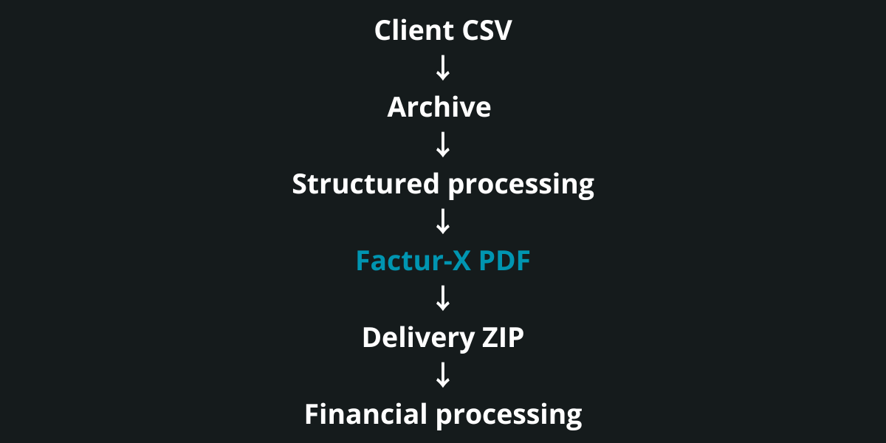

<p align="center">
  
</p>

> 🇬🇧 English | [🇫🇷 Français](./README_FR.md)


<p align="center">
  <a href="https://palks-studio.com">
    
  </a>
  &nbsp;
  <a href="https://comeup.com/fr/@palksstudio">
    
  </a>
</p>


# Palks Studio — Automation System
**Financial automation built for rigor, traceability, and longevity**

> This repository is a technical presentation and documentation repository.  
> It does not contain downloadable source code or production files.

This README documents design principles and system architecture.  
It intentionally avoids operational procedures and sensitive details.

---

## Overview

This repository presents a financial automation system designed to handle:  

- invoice generation (single & batch)  
- revenue tracking  
- payment reconciliation  
- client balances  
- accounting-ready exports

The system is deterministic, auditable, and explicit by design.

It operates:  

- without a database  
- without a CMS  
- without a SaaS dependency  
- without any exposed web interface

All executions run server-side, via CLI scripts and cron, with a strict separation of responsibilities.

This project is not a product, not a SaaS, and not a plug-and-play tool.  
It documents a production-grade approach to financial automation.

Over time, the engine has been progressively extended  
to cover real-world business cases,  
without compromising its original design principles.

The billing system now supports:  

- multi-line invoices  
- multiple VAT rates per invoice  
- complex or extended service periods  
- multi-month billing scenarios  
- complex combinations while remaining EN16931 Comfort compliant

This functional expansion did not alter  
the deterministic, auditable, and traceable nature of the system.

### Electronic invoicing (Factur-X)

The system natively integrates Factur-X electronic invoicing (hybrid PDF with embedded XML),  
in compliance with the European EN 16931 standard (Comfort profile):  

- generation of a semantically EN 16931-compliant Factur-X XML  
- XML validation (XSD and Schematron)  
- injection of the XML into the PDF  
- production of a single final document: the Factur-X hybrid PDF  
- direct integration into the `run.php` and `run_batch.php` pipelines  
- no parallel formats  
- no persistent XML storage

The system targets business compliance and e-invoicing interoperability (France / EU).  
PDF/A compliance (document archiving) is not a functional objective of the project and is deliberately out of scope.

Factur-X is handled as a native component of the engine,  
not as an external or optional module.

---

## Project structure

```
automation_finance/
│
├── engine/
│   ├── build_facturx_xml.php         → Factur-X XML generation
│   ├── build_json.php                → Client onboarding JSON builder
│   ├── inject_facturx.py             → Factur-X XML injection into PDF
│   ├── run.php                       → Main automation engine (cron / CLI)
│   ├── run_batch.php                 → Batch automation engine for client invoicing
│   ├── billing_rules.php             → Billing rules and dynamic pricing logic
│   ├── alerts.php                    → Execution alerts and notifications handling
│   ├── import_csv.php                → Client CSV import and validation handler
│   ├── mailer.php                    → Email sender with invoice attachment
│   ├── mail_signature.php            → Palks Studio signature
│   ├── vendor/                       → PHP dependencies (e.g. DomPDF)
│   └── templates/                    → Invoices PDF template (bilingual FR / EN)
│
├── data/
│   ├── logs/                         → Execution logs per client
│   ├── onboarding/                   → JSON files generated by the client onboarding form
│   ├── onboarding_done/              → Processed onboarding JSON archived after build
│   ├── archive_batch/                → Archived client CSV
│   ├── batch_sent/                   → Zip sent
│   ├── usage/                        → Monthly client usage tracking
│   ├── revenues/                     → Cumulative revenues (internal accounting source)
│   ├── payments/                     → Payments received from the client (bank transfers, actually received amounts)
│   ├── balance/                      → Client accounting balance (invoiced vs paid, paid / unpaid status)
│   ├── invoices/                     → Invoices from the main activity (direct invoicing, internal use)
│   ├── invoices_batch/               → Invoices generated as part of the batch service (end clients)
│   ├── inbox_batch/                  → Client-provided CSV file (batch invoicing source)
│   ├── counters/                     → Annual invoice counter per client (direct invoicing)
│   └── counters_batch/               → Annual invoice counter per client (batch invoicing)
│
├── tools/
│   ├── update_balances.php           → Updates client balances based on revenues and payments
│   ├── find_client.php               → Client lookup utility
│   ├── build_client.php              → Client email index builder
│   ├── send_paid_receipts.php        → Automatic sending of paid client receipts
│   ├── purge_log.php                 → Cleanup Script
│   ├── client_project.php            → CLI script aggregating and exporting client data by identifier
│   ├── recettes_year.php             → Export actually received revenues for a full year
│   ├── recettes_month.php            → Export actually received revenues for a given month
│   └── revenues_csv.php              → Export revenues to a CSV file (accounting)
│
├── exports/
│   ├── recettes/                     → Monthly CSV exports generated on demand / Yearly CSV exports generated on demand
│   └── payments/                     → CSV generated from the received payments JSON files
│
├── downloads/                        → Monthly ZIP archives per client, containing automatically generated PDF invoices
├── clients/                          → Client configuration file (only file to edit per client)
├── batch_clients/                    → Batch configuration for an end client (monthly invoicing)
├── CONTRATS/                         → Legal documents related to the service
│
├── LICENCE.md                        → Conditions d’utilisation et cadre légal (FR)
├── LICENSE.md                        → Terms of use and legal Framework
│
└── docs/
    ├── README_FR.md                  → Documentation générale du système (FR)
    ├── README.md                     → General system documentation
    │
    ├── SERVICE_MEMO_FR.md            → Note interne de positionnement du service (FR)
    ├── SERVICE_MEMO.md               → Internal Service Positioning Memo
    │
    ├── README_DEPLOY_FR.md           → Guide d’installation et d’exploitation (FR)
    ├── README_DEPLOY_EN.md           → Installation and Production Guide
    │
    ├── VUE_DENSEMBLE_AUTOMATION.md   → Vue d’ensemble du système d’automatisation de facturation (FR)
    └── SYSTEM_OVERVIEW_AUTOMATION.md → Billing Automation System Overview
```


---

## What this repository is (and is not)

### This repository is

- a documented architecture for financial automation  
- a system designed to be predictable and auditable  
- an example of strict separation between billing, payments, and accounting  
- a real-world system used in production

### This repository is not

- a certified accounting software  
- a ready-to-use invoicing tool  
- a payment processing system  
- a web application or API service

The outputs produced by this system are intended for internal operational use and for integration with standard accounting workflows.

---

## Core design principles

This system follows a small set of non-negotiable principles:  

- **No magic**  
  Every operation is explicit and traceable.

- **No silent processing**  
  Errors stop execution. They are logged and surfaced.

- **No implicit correction**  
  Invalid inputs are rejected, not “fixed”.

- **Files are proofs**  
  Generated artifacts are considered immutable evidence, not disposable outputs.

- **Strict separation of responsibilities**  
  Billing, payments, balances, receipts, and exports are handled independently.

- **CLI-only execution**  
  No web exposure, no background ambiguity.

These principles favor predictability over convenience and clarity over speed.

The progressive extension of the engine  
did not compromise these principles.

Newly added capabilities  
(multi-line invoices, multiple VAT rates, complex service periods)  
strictly follow the same rules  
of predictability, traceability, and explicit rejection.

---

## System architecture (high-level)

The system is composed of independent layers, each with a single responsibility:  

- **Billing engines**  
  - direct invoicing  
  - batch invoicing (CSV-driven)

- **Business rules**  
  - centralized pricing and billing logic  
  - single source of truth

- **Alerting layer**  
  - blocking vs informational alerts  
  - explicit execution feedback

- **Payment layer**  
  - manual payment records  
  - deliberately decoupled from billing

- **Balance reconciliation**  
  - computed state (invoiced vs paid)  
  - paid / unpaid detection

- **Export layer**  
  - accounting-ready CSV outputs  
  - reproducible at any time

Some layers can evolve independently  
without impacting others,  
allowing the system to be extended  
without global side effects.

---

## Project structure (conceptual view)

The directory layout mirrors the system’s responsibilities:  

`engine/`        → execution engines & business logic  
`clients/`       → client configuration (one file per client)  
`batch_clients/` → batch client definitions  
`data/`          → immutable operational data (logs, invoices, balances)  
`docs/`          → internal specifications (e.g. CSV format)  
`tools/`         → reconciliation and export utilities  
`exports/`       → generated accounting artifacts  
`downloads/`     → packaged invoice archives


Each directory exists for one reason only.  
Cross-responsibility coupling is intentionally avoided.

---

## Execution model

The system runs on a closed, repeatable cycle:  

1. **Generation phase**  
   Invoices are generated based on explicit rules and configurations.

2. **Payment phase**  
   Payments are recorded independently, without automation or assumptions.

3. **Reconciliation phase**  
   Invoiced amounts are compared against received payments.

4. **Consolidation phase**  
   Client balances are computed and statuses updated.

5. **Export phase**  
   Accounting-ready artifacts are produced on demand.

### Client onboarding tool

`engine/build_json.php` converts onboarding data into the internal  
client configuration used by the automation pipeline.

During processing, the script:  

- generates a unique `client_id`  
- creates the client configuration  
- prepares the batch client definition  
- initializes payment tracking  
- archives the processed onboarding record

This step occurs strictly during the preparation phase and does not  
interfere with the monthly execution cycle.

At no point does the system infer or guess missing information.

---

## Batch invoicing model

In batch mode:  

- one client provides one CSV file  
- one CSV line equals one invoice  
- validation is strict and structural  
- the entire batch stops on the first error  
- raw inputs are archived before consumption

This model favors data integrity over partial success.

The billing model supports complex use cases  
without altering the execution cycle:  

- multi-line invoices  
- multiple VAT rates within a single invoice  
- extended or split service periods  
- multi-month billing scenarios

These capabilities are integrated  
without introducing implicit conditional logic  
or special-case processing outside the engine.

### Entry point — client CSV upload

The monthly CSV file is submitted by the client through a dedicated  
upload form, accessible only via an individual secure link provided  
after contract validation.

The entry point:  

- accepts CSV files only  
- provides a downloadable reference CSV template  
- stores the file in the structured `inbox_batch/` directory  
- enforces a single submission per client and period  
- preserves the file for strict downstream validation

The uploaded CSV is treated as a **raw billing data source**  
and is never considered a final invoice.

It is later validated and consumed exclusively by `run_batch.php`  
within the standard batch processing pipeline.

---

## Integrity & safeguards

Several mechanisms are enforced across the system:  

- anti-duplicate protections  
- annual sequential counters  
- immutable archives  
- explicit execution flags  
- categorized alerts  
- exhaustive logging

A failed execution is considered safer than a partial one.

Validation rules remain identical  
regardless of invoice complexity.

A complex case is treated  
with the same requirements as a simple one.

---

## Security posture

- CLI-only execution  
- no exposed endpoints  
- no browser access  
- no external API dependency for core operations  
- data stored locally on the server

Security is achieved through absence of surface, not complexity.

---

## Maintenance & longevity

The system is designed to:  

- be understandable without its original author  
- be auditable months or years later  
- degrade loudly rather than silently  
- integrate cleanly with standard accounting processes

This repository documents an engineering approach, not a shortcut.

---

## Project status

Status: Stable — used in real production conditions.

The system has been designed to operate autonomously,  
with a strong emphasis on rigor, traceability, and long-term maintainability.

---

© Palks Studio — see LICENSE.md  
https://palks-studio.com
