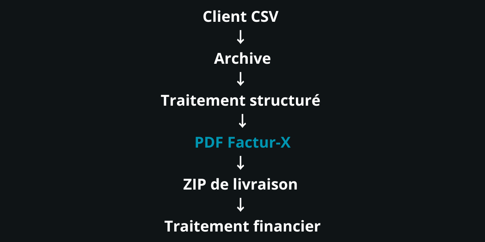

<p align="center">
  
</p>

> 🇫🇷 Français | [🇬🇧 English](./README.md)


<p align="center">
  <a href="https://palks-studio.com">
    
  </a>
  &nbsp;
  <a href="https://comeup.com/fr/@palksstudio">
    
  </a>
</p>

# Palks Studio — Système d’automatisation  
**Automatisation financière conçue pour la rigueur, la traçabilité et la durée**

> Ce dépôt constitue une présentation technique et une documentation du projet.  
> Il ne contient pas de code source téléchargeable ni de fichiers de production.

Ce README documente les principes de conception et l’architecture du système.  
Il évite volontairement toute procédure opérationnelle ou détail sensible.

---

## Vue d’ensemble

Ce dépôt présente un système d’automatisation financière conçu pour gérer :  

- la génération de factures (directe et batch)  
- le suivi des recettes  
- la réconciliation des paiements  
- les soldes clients  
- les exports comptables exploitables

Le système est déterministe, auditable et explicite par conception.

Il fonctionne :  

- sans base de données  
- sans CMS  
- sans dépendance SaaS  
- sans interface web exposée

Toutes les exécutions se font côté serveur, via scripts CLI et cron, avec une séparation stricte des responsabilités.

Ce projet n’est pas un produit, pas un SaaS, pas un outil clé en main.  
Il documente une approche de production sérieuse de l’automatisation financière.

Depuis ses premières versions, le moteur a été progressivement enrichi  
pour couvrir des cas métier réels et complexes, sans remettre en cause  
les principes de départ.

La facturation prend désormais en charge :  

- des factures multi-lignes  
- des factures à multi-taux de TVA  
- des périodes de service étendues ou fractionnées  
- des facturations couvrant plusieurs mois  
- des combinaisons complexes tout en restant conformes EN16931 Comfort

L’enrichissement fonctionnel n’a pas modifié  
la nature déterministe, auditable et traçable du système.

### Facturation électronique (Factur-X)

Le système intègre nativement la génération de factures Factur-X (PDF hybride + XML embarqué),  
conformément à la norme européenne EN 16931 (profil Comfort) :  

- génération d’un XML Factur-X sémantiquement conforme EN 16931  
- validation du XML (XSD et Schematron)  
- injection du XML dans le PDF  
- production d’un unique document final : le PDF hybride Factur-X  
- intégration directe dans les pipelines `run.php` et `run_batch.php`  
- aucun format parallèle  
- aucun stockage XML persistant

Le système vise la conformité métier et l’interopérabilité e-facturation (France / UE).  
La conformité PDF/A (archivage documentaire) n’est pas un objectif fonctionnel du projet et est volontairement hors périmètre.  

Factur-X est traité comme un composant natif du moteur,  
et non comme un module externe ou optionnel.

---

## Structure du projet

```
automation_finance/
│
├── engine/
│   ├── build_facturx_xml.php         → Génération du XML Factur-X
│   ├── build_json.php                → Génération du JSON d’onboarding client
│   ├── inject_facturx.py             → Injection du XML Factur-X dans le PDF
│   ├── run.php                       → Moteur principal d’automatisation (cron / CLI)
│   ├── run_batch.php                 → Moteur d’automatisation BATCH pour la facturation clients
│   ├── billing_rules.php             → Règles de facturation et de tarification dynamique
│   ├── vendor/                       → Dépendances PHP (ex: DomPDF)
│   ├── alerts.php                    → Gestion des alertes et notifications d’exécution
│   ├── import_csv.php                → Import et validation des fichiers CSV clients
│   ├── mailer.php                    → Envoi des emails avec facture en pièce jointe
│   ├── mail_signature.php            → Signature Palks Studio
│   └── templates/
│       └── invoice.html.php          → Templates PDF de facture (bilingue FR / EN)
│
├── data/
│   ├── logs/                         → Logs d’exécution par client
│   ├── onboarding/                   → Fichiers JSON issus du formulaire d’onboarding client
│   ├── onboarding_done/              → JSON d’onboarding traités et archivés après build
│   ├── archive_batch/                → CSV client archivé
│   ├── batch_sent/                   → Zip envoyés
│   ├── usage/                        → Suivi d’usage mensuel par client
│   ├── revenues/                     → Recettes cumulées (source comptable interne)
│   ├── payments/                     → Paiements reçus du client (virements, montants réellement encaissés)
│   ├── balance/                      → Solde comptable du client (facturé vs payé, statut payé / impayé)
│   ├── invoices/                     → Factures de l’activité principale (facturation directe, usage interne)
│   ├── invoices_batch/               → Factures générées dans le cadre du service batch (clients finaux)
│   ├── inbox_batch/                  → Fichier CSV fourni par le client (source de facturation batch)
│   ├── counters/                     → Compteur annuel de factures par client (facturation directe)
│   └── counters_batch/               → Compteur annuel de factures par client (facturation batch)
│
├── tools/
│   ├── update_balances.php           → Met à jour les soldes clients à partir des recettes et des paiements
│   ├── find_client.php               → Recherche d’une fiche client
│   ├── build_client.php              → Génération de l’index email
│   ├── send_paid_receipts.php        → Envoi automatique des reçus clients payés
│   ├── purge_log.php                 → Script de nettoyage
│   ├── recettes_year.php             → Script PHP d’export des recettes encaissées sur une année complète
│   ├── recettes_month.php            → Script PHP d’export des recettes encaissées sur un mois donné
│   └── revenues_csv.php              → Script PHP d’export des recettes vers un fichier CSV (comptabilité)
│
├── exports/
│   ├── recettes/                     → CSV mensuels / annuels générés à la demande
│   └── payments/                     → CSV généré à partir des fichiers JSON de paiements reçus
│
├── downloads/                        → Archives ZIP mensuelles par client, contenant les factures PDF générées automatiquement
├── clients/                          → Fiche client (seul fichier à modifier par client)
├── batch_clients/                    → Configuration batch d’un client final (facturation mensuelle)
├── CONTRATS/                         → Documents contractuels et juridiques du service
│
├── LICENCE.md                        → Conditions d’utilisation et cadre légal
│
└── docs/
    ├── README_FR.md                  → Documentation générale du système
    ├── SERVICE_MEMO_FR.md            → Note interne de positionnement du service
    ├── README_DEPLOY_FR.md           → Guide d’installation et d’exploitation
    └── VUE_DENSEMBLE_AUTOMATION.md   → Vue d’ensemble du système d’automatisation de facturation
```


---

## Ce que ce dépôt est (et n’est pas)

### Ce dépôt est

- une architecture documentée d’automatisation financière  
- un système pensé pour être prévisible et auditable  
- un exemple de séparation stricte entre facturation, paiements et comptabilité  
- un système réel utilisé en conditions de production

### Ce dépôt n’est pas

- un logiciel de comptabilité certifié  
- un outil de facturation prêt à l’emploi  
- un système de paiement automatisé  
- une application web ou une API

Les données produites sont destinées à un usage interne et opérationnel,  
et à une intégration propre avec des processus comptables classiques.

---

## Principes de conception

Ce système repose sur un ensemble de principes non négociables :  

- **Aucune magie**  
  Chaque opération est explicite et traçable.

- **Aucun traitement silencieux**  
  Une erreur bloque l’exécution et est loggée.

- **Aucune correction implicite**  
  Une donnée invalide est rejetée, jamais “corrigée”.

- **Les fichiers sont des preuves**  
  Les artefacts générés sont considérés comme immuables.

- **Séparation stricte des responsabilités**  
  Facturation, paiements, soldes, reçus et exports sont indépendants.

- **Exécution exclusivement en CLI**  
  Aucun accès web, aucune ambiguïté.

Ces choix privilégient la prévisibilité à la commodité,  
et la clarté à la vitesse.

L’enrichissement progressif du moteur  
n’a pas remis en cause ces principes.

Les fonctionnalités ajoutées  
(multi-lignes, multi-taux de TVA, périodes complexes)  
respectent strictement les mêmes règles  
de prévisibilité, de traçabilité et de rejet explicite.

---

## Architecture du système (vue globale)

Le système est composé de couches indépendantes, chacune ayant une responsabilité unique :  

- **Moteurs de facturation**  
  - facturation directe  
  - facturation batch (CSV)

- **Règles métier**  
  - logique tarifaire centralisée  
  - source de vérité unique

- **Couche d’alertes**  
  - alertes bloquantes vs informatives  
  - retours d’exécution explicites

- **Couche paiements**  
  - enregistrements manuels  
  - volontairement découplée de la facturation

- **Réconciliation des soldes**  
  - calcul facturé vs payé  
  - détection payé / impayé

- **Couche exports**  
  - fichiers CSV exploitables comptablement  
  - régénérables à tout moment

Certaines couches peuvent évoluer indépendamment  
sans modifier les autres,  
ce qui permet d’enrichir le système  
sans effet de bord global.

---

## Structure du projet (vue conceptuelle)

L’arborescence reflète directement les responsabilités du système :  

`engine/`        → moteurs d’exécution et logique métier  
`clients/`       → configuration client (un fichier par client)  
`batch_clients/` → définitions clients batch  
`data/`          → données opérationnelles immuables  
`docs/`          → spécifications internes (ex : format CSV)  
`tools/`         → outils de réconciliation et d’export  
`exports/`       → artefacts comptables générés  
`downloads/`     → archives de factures


Chaque dossier existe pour une seule raison précise.  
Tout couplage transversal est volontairement évité.

---

## Modèle d’exécution

Le système fonctionne selon un cycle fermé et reproductible :  

1. **Phase de génération**  
   Les factures sont produites selon des règles explicites.

2. **Phase de paiement**  
   Les paiements sont enregistrés indépendamment, sans automatisme.

3. **Phase de réconciliation**  
   Les montants facturés sont comparés aux paiements reçus.

4. **Phase de consolidation**  
   Les soldes clients sont calculés et mis à jour.

5. **Phase d’export**  
   Les données comptables sont générées à la demande.

Les configurations clients sont préparées en amont via le formulaire  
d’onboarding puis transformées par `engine/build_json.php`  
avant leur utilisation par le moteur batch.

Le système ne devine jamais une information manquante.

---

## Facturation batch

En mode batch :  

- un client fournit un fichier CSV  
- une ligne CSV correspond à une facture  
- la validation est stricte et structurelle  
- le batch entier s’arrête à la première erreur  
- les entrées brutes sont archivées avant consommation

Ce modèle privilégie l’intégrité des données au succès partiel.

Le modèle de facturation prend en charge  
des cas complexes sans modifier le cycle d’exécution :  

- factures multi-lignes  
- multi-taux de TVA au sein d’une même facture  
- périodes de service étendues ou fractionnées  
- facturation couvrant plusieurs mois

Ces capacités sont intégrées  
sans introduire de logique conditionnelle implicite  
ni de traitement spécial hors moteur.

---

## Intégrité et garde-fous

Le système met en œuvre :  

- protections anti-doublons  
- compteurs séquentiels annuels  
- archives immuables  
- flags d’exécution explicites  
- alertes catégorisées  
- journalisation exhaustive

Un arrêt franc est considéré plus sûr qu’un traitement incomplet.

Les règles de validation restent identiques  
quel que soit le niveau de complexité des factures.

Un cas complexe est traité  
avec les mêmes exigences qu’un cas simple.

---

## Posture de sécurité

- exécution exclusivement en CLI  
- aucun endpoint exposé  
- aucun accès navigateur  
- aucune dépendance API critique  
- données stockées localement sur le serveur

La sécurité repose sur l’absence de surface d’attaque,  
pas sur la complexité.

---

## Maintenance et pérennité

Le système est conçu pour :  

- être compris sans son auteur  
- être audité des mois ou années plus tard  
- échouer de manière visible  
- s’intégrer proprement à des flux comptables standards

Ce dépôt documente une approche d’ingénierie, pas un raccourci.

---

## État du projet

Statut : Stable — utilisé en conditions réelles de production.

Le système est conçu pour fonctionner de manière autonome,  
avec une exigence forte de rigueur, traçabilité et maintenabilité long terme.
---

© Palks Studio — voir LICENSE.md  
- https://palks-studio.com
